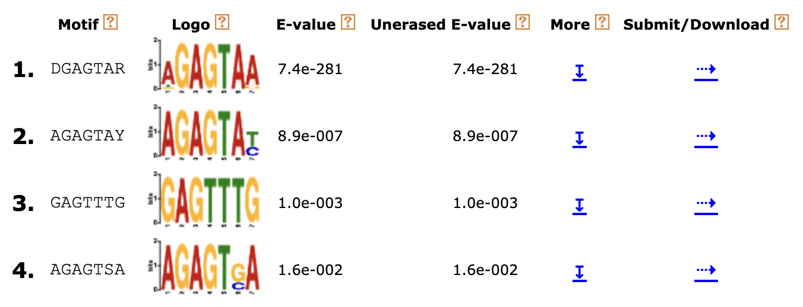
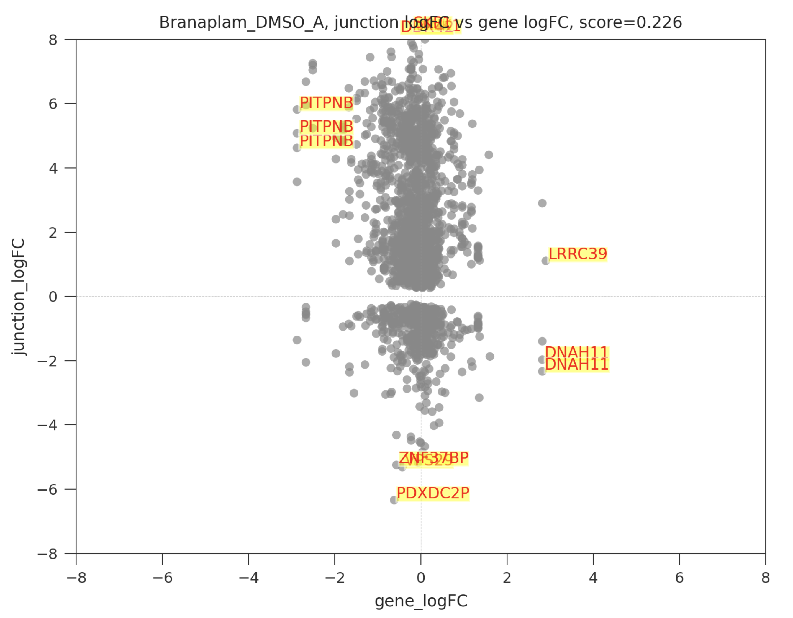

<picture></picture>
## splicekit: a toolkit for splicing analysis from short-read RNA-seq

A comprehensive platform for splicing analysis of RNA-seq short-read sequencing data. <b>splicekit</b> input are read alignments in BAM format (look at [datasets](datasets) for details on how to run examples).

[What is splicekit?](#what_do)<br>
[Installation](#initial_setup)<br>
[Quick start](#quick_start)<br>
[Software dependencies](#software_dep)<br>
[Example runs and datasets](#examples)<br>
[Running splicekit](#running_splicekit)<br>
&nbsp;&nbsp;[Annotation and comparisons](#annot_comp)<br>
&nbsp;&nbsp;[Preparing feature (genes, exon, junction, anchor) data tables](#make_tables)<br>
&nbsp;&nbsp;[Running edgeR gene context analysis on junction features](#id_features)<br>
[Motif analysis](#motif)<br>
[Scanning for RNA-protein binding with scanRBP](#scanRBP)<br>
[juDGE plots](#judgeplot)<br>
[JBrowse2 visualizations](#jbrowse)<br>
[Documentation and specifications](#filedescriptors)<br>
[Changelog](#changelog)<br>

<b>splicekit</b> is a modular platform for splicing analysis of RNA-seq datasets. The platform also integrates an JBrowse2 instance together with [pybio](https://github.com/grexor/pybio) for genomic operations and [scanRBP](https://github.com/grexor/scanRBP) for RNA-protein binding studies. The whole analysis is self-contained (one single folder) and the platform is written in Python, in a modular way.

## What is splicekit?<a name="what_do"></a>
From an initial config file (`splicekit.config`), sample annotation (`samples.tab`) and aligned reads in BAM format, splicekit first defines comparisons (which test samples to compare to which controls). Next, feature count tables are generated (exons, anchors, junctions, genes) based on defined comparisons. Analysis incude edgeR alt-splice (differentially used features), motif analysis with DonJuAn (junction-anchor) and DREME, RNA-protein binding enrichment analysis with scanRBP and clustering analysis on expression of features. To facilitate result and data interpretation, splicekit also provides an instance of JBrowse2.

## Installation<a name="initial_setup"></a>

The easiest way to install splicekit is to simply run:

`$ pip install splicekit`

Note that on some systems, pip is installing the executable scripts under `~/.local/bin`. However this folder is not in the PATH which will result in `command not found` if you try to run `$ splicekit` on the command line. To fix this, please execute `export PATH="$PATH:~/.local/bin"` (and add this to your `.profile`). Another suggestion is to install inside a virtual environment (using `virtualenv`).

If you would like to install splicekit directly from this repository, clone the repository into a folder, for example `~/software/splicekit`. Add the `~/software/splicekit` folder to $PYTHONPATH (`export PYTHONPATH=$PYTHONPATH:~/software/splicekit`).

## Quick start<a name="quick_start"></a>

If you already have aligned reads in BAM files, all you need is `samples.tab` and `splicekit.config` in one folder and the reference genome annotation downloaded and parsed (e.g. `$ pybio genome homo_sapiens`). Then run `$ splicekit process`. Check [datasets](datasets) examples to see how these files look like and also to check scripts if you need to map reads from FASTQ files with `pybio`.

## Software dependencies<a name="software_dep"></a>

splicekit uses several third-party open-source software. If you don't have the software installed on your system, we prepared a [singularity definition file](singularity), where you can also directly see all dependencies. Using the singularity image, you don't need to install the dependencies yourself, you just need to install singularity.

## Example runs and datasets<a name="examples"></a>

Example runs can be found in the [datasets](datasets) folder.

## Configuration file documentation

<details>
<summary>Description of splicekit.config file parameters (click to show)</summary>

Core parameters that need to be set for the analyses to be run:

| Parameter | Description | Default / Example |
|-|-|-|
| study_name | descriptive short study name | "My study" |
| library_type | "single-end", "paired-end" | "paired-end" |
| library_strand | ["SECOND_READ_TRANSCRIPTION_STRAND", "FIRST_READ_TRANSCRIPTION_STRAND", "SINGLE_STRAND", "SINGLE_REVERSE", "NONE"]<br><br>For unstranded data, we enter "NONE". For paired-end stranded data,  the most common is "SECOND_READ_TRANSCRIPTION_STRAND", which means the second read of the pair maps in the transcript direction, and the first read maps in the reverse direction. For stranded single-end sequencing, "SINGLE_STRAND" means the reads map in the transcript direction, and "SINGLE_REVERSE" means the reads map on the opposite strand of the transcripts. Also for single-end unstranded we specify "NONE". | "NONE" |

Sample annotation and bam file location:

| Parameter | Description | Default / Example |
|-|-|-|
| sample_column | where are sample ids stored; we expect bam names: sample_id1.bam, sample_id2.bam, ... | "sample_id" |
| treatment_column | which column defines treatment (test and control labels) | "treatment_id" |
| control_name | name of controls in the treatment_column, other samples are compared to these marked controls | "DMSO" |
| separate_column | separate comparisons by grouping samples on separate_column? if "", do not separate | "" |
| group_column | only include controls in the same range as other samples (sample replicates on plate1,plate2,plate3? only include controls from plate1 plate2,plate3) | ""

Genome specific parameters, connected with pybio:

| Parameter | Description | Default / Example |
|-|-|-|
| species | genome species, this is connected with pybio and Ensembl | "homo_sapiens"
| genome_version | Ensembl genome version or custom genome version, leave None to take latest Ensembl version | None
| bam_path | folder where bam files are stored | "bam"

scanRBP parameters:

| Parameter | Description | Default / Example |
|-|-|-|
| scanRBP | would you like to run scanRBP? (False / True) | True
| protein | name of the protein for scanning sequences with the protein PWM | "K562.TARDBP.0"
| protein_label | short label for the used protein | "TDP43"

Processing parameters:

| Parameter | Description | Default / Example |
|-|-|-|
| platform | "desktop" or "cluster" (HPC with SLURM) | "desktop"
| container | leave empty or "singularity run path_to/splicekit.sif"

Visualization, labelling and other parameters:

| Parameter | Description | Default / Example |
|-|-|-|
| short_names | List of triples for shortening names in results, if last string is "complete", only entire strings will be considered (no partial replacement) | [], example: [("cell_line_A", "A", "complete")], this would only replace cell_line_A with A if cell_line_A is the whole string, while if "partial" is provided, also strings like ...cell_line_A... would be replaced with ...A... | ("original name", "short name", "complete")

</details>

After setting the basic parameters in your `splicekit.config` file, simply run `splicekit process` inside the folder with your config file. This will run all available analysis on your dataset (see details of inidividual commands in **Running Splicekit**)

## Running splicekit <a name="running_splicekit"></a>

For example files (`splicekit.config` and `samples.tab`) please look in the [datasets](datasets) folder.

If you have a folder with `splicekit.config` and `samples.tab`, a comprehensive run of all analysis is incorporated in a single splicekit command: `splicekit process`. Each analysis step can be run separately by a single splicekit command.
<details>
<summary>Click to show splicekit commands</summary>

```
splicekit process        # runs all analysis
splicekit setup          # initializes folder structure and downloads Fontawesome for html reports
splicekit annotation     # downloads Moose annotation and creates comparisons
splicekit features       # prepares count tables in data/* folders for junctions, exons, anchors
splicekit edgeR          # runs edgeR analysis on the cluster
splicekit motifs         # runs motif analysis together with scanRBP
splicekit promisc        # runs promisc analysis from edgeR results
splicekit judge          # generates juDGE plots
splicekit clusterlogfc   # generates cluster of pair-wise logFC comaprisons of samples at the exon, junction and gene levels
splicekit version        # prints out current version
splicekit jbrowse2       # starts JBrowse2 visualization with local web server
```

</details>

Let's shortly describe and comment individual steps with the required inputs and resulting outputs.

### Annotation and comparisons <a name="annot_comp"></a>

This first step of the analysis (`splicekit annotation`) loads samples from the file `samples.tab`. It also uses the `treatment_column` (where is the treatment stored), `control_name` (name of the controls in the treatment column), `group_column` (group experiments by this property, e.g. plate) and `separate_column` (generate comparisons inside groups, e.g. cell_type) to create comparisons. Each treatment (can have several replicates / samples / readouts) is compared to the controls.

<details>
<summary>An example sample.tab would look like this (click to show)</summary>

| sample_id | treatment_id |
|-|-|
| sample1 | control |
| sample2 | control |
| sample3 | control |
| sample4 | test1 |
| sample5 | test1 |
| sample6 | test1 |
| sample7 | test2 |
| sample8 | test2 |
| sample9 | test2 |

splicekit would then expect BAM files with names `sample_id`.bam to be present (`sample1.bam`, `sample2.bam`, etc.) in the folder `bam_path` parameter specified in the `splicekit.config` file.

</details>

Once we have loaded and process the sample annotation, splicekit creates **comparisons**, by default this will compare treated samples to control samples. The comparisons are also stored in a simple tab delimited file, `annotation/comparisons.tab`:

| comparison | compound_samples | DMSO_samples |
|-|-|-|
| test1_control | sample4_test1,sample5_test1,sample6_test1 | sample1_control,sample2_control,sample3_control |
| test2_control | sample7_test2,sample8_test2,sample9_test2 | sample1_control,sample2_control,sample3_control |

In addition, this step will also create <b>processing shell scripts</b> and <b>cluster job files</b> (`jobs/*`). An example cluster job file:

```
#!/bin/bash
#BSUB -J edgeR_junctions_sample1                  # Job name
#BSUB -n 4                                        # number of tasks
#BSUB -R "span[hosts=1]"                          # Allocate all tasks in 1 host
#BSUB -q short                                    # Select queue
#BSUB -o logs_edgeR_junctions/sample1_control.out # Output file
#BSUB -e logs_edgeR_junctions/sample1_control.err # Error file

ml R
R --no-save --args splicekit comparison_junctions_data junctions control test ... < comps_edgeR.R
```

## Preparing features (junctions, anchors, exons, genes) count tables<a name="make_tables"></a>

Running `splicekit features` will create count tables for junctions, anchors, exons and genes.

<details>
<summary>What are features?</summary>

We operate with 4 types of features (extendable in the future): junctions, anchors, exons and genes. All feature ids have the same format: `chrstrand_start_stop`. An example would be `chrX-_154371360_154374505`. Please check [genomic coordinates](#genomic_coordinates) for an explanation of how we report genomic coordinates accross splicekit.

Here a short description of the feature types (**feature_type**) we use:

* **genes** are annotated genes from refseq/ensembl
* **exons** are annotated exons from refseq/ensembl
* **junctions** are features connecting exons
* anchors are of two types: **donor_anchors** and **acceptor_anchors**. Donor anchors are 15nt regions upstream (inside the exon) of the donor site. Acceptor anchors are 15nt regions downstream from the acceptor site (inside the exon). Each junction has 2 anchors: donor anchor and acceptor anchor. We use anchors to evaluate the effect of junction changes, because we do not have exon information for non-annotated junctions and because taking a fixed 15nt region standardizes this kind of analysis (JUAN, junction-anchor).

</details>

In the folders `data/sample_{feature_type}_data`, each individual file (table) contains the list of all features and the count for the individual sample. Example file would be `data/sample_exons_data/sample_99.tab`:

```
exon_id	count
1+_1471764_1472088	13
1+_1477273_1477349	4
1+_1478643_1478744	0
1+_1479048_1479107	0
1+_1480866_1480935	0
1+_1482137_1482302	12
```

The second type of count tables are then the individual comparison tables. Each of these comparisons tables contain <b>all</b> the count information (all samples involved in the comparison). An example for a junction comparison file named `data/comparison_junctions_data/test_control.tab` would be:

| GeneID | Start | End | Length | Symbol | 1_test | 2_test | 3_test | 4_control | 5_control | 6_control |
|-|-|-|-|-|-|-|-|-|-|-|
| 1 | 58347029 | 58347353 | 325 | A1BG | 42 | 31 | 109 | 75 | 86 | 33 |
| 1 | 58347640 | 58350370 | 2731 | A1BG | 0 | 0 | 3 | 1 | 0 | 0 | 0 |
| 1 | 58350651 | 58351391 | 741 | A1BG | 0 | 0 | 10 | 1 | 0 | 0	| 3 |

## Running edgeR gene context analysis on junction features <a name="id_features"></a>

Running edgeR analysis on features (either genes, exons, junctions or anchors) consist of simply running the process script or submitting all matching job files to the cluster. This is done by the `splicekit edgeR` command.

Results are stored in the files `results/results_edgeR_{feature_type}` where feature_type is one of ["genes", "exons", "junctions", "donor_anochors", "acceptor_anchors"]. Results with FDR < `splicekit.config.edgeR_FDR_thr` are reported (sorted by FDR), linked to JBrowse with URL links.

## Motif analysis <a name="motif"></a>

Motif analysis on donor site patterns (9nt sequences) is performed on the top 100 hits for each comparison. The analysis is run by `splicekit motifs`. Html reports are generated at `results/motifs`. In addition to computing motif logos, we run DREME on regulated sequences vs. controls.



## scanRBP <a name="scanRBP"></a>

To identify potential enrichment of RNA-protein binding at regulated sites (donor sites, acceptor sites, other areas), we developed and integrated [scanRBP](https://github.com/grexor/scanRBP) with splicekit.

Once we identify sets of control and regulated sequences, we compute log-odds of the binding signal for a specific protein of interest from it's PWMs. Performing bootstraps on the sequence labels, we can estimate the probability the binding at regulated sequences is different from the control binding (log-fc of the binding signal).

[scanRPB](https://github.com/grexor/scanRBP) is integrated with splicekit and can also be used separately as an individual package (`pip install scanRBP`).

## juDGE plots <a name="judgeplot"></a>

To determine the effect of a treatment (more involved in gene expression changes in general or more involved in splicing changes) we can generate juDGE plots (junction logFC vs. gene logFC). These plots are stored in `results/judge/*` and contain PNG images and also html interactive plotly reports (mouse over shows data and gene name).



On the plot above, the left panel represents a comparison where the compound causes mostly changes in junctions of several genes (y axis) and junctions are much more perturbed compared to gene expression in general (activity on the x axis). This compound would be characterized as a "splicing modifier".

In contrast, the comparison on the right panel shows more activity on changing gene expression in general (x axis). The compound involved would be labeled as "expression modifier".

## JBrowse2 visualizations <a name="jbrowse"></a>

To graphically explore results, we use JBrowse. We incorporate a lightweight pybio web server to explore JBrowse2 results locally, by running `splicekit jbrowse2`.

## Documentation and specifications<a name="filedescriptors"></a>
Global specifications and documentation on file formats, analysis results and other objects produced by splicekit.

<details>
<summary><b>Genomic Coordinates</b> (click to show details)</summary><a name="genomic_coordinates"></a>

All genomic coordinates we operate with inside splicekit are **0-based left+right inclusive**. This means, when we say for example 100-103, this would include coordinates 100, 101, 102 and 103. The first coordinate is 0. More specific details:

* feature specific documentation
  
  All feature coordinates (junctions, anchors, exons) are given in a numeric sort order regardless of strand (feature_start is always < feature_stop).
  Example chr1+_100_102 would represent a junction spanning coordinates [100,101,102]).
  Example chr1-_100_102 would represent a junction spanning coordinates [102,101,100]).

* junction specific documentation
  
  Junction coordinates cover/overlap 1-nucleotide of adjoining exons.
  Example 1: `chr1+_100_200` represents a junction on chromosome 1 (+ strand) from [100..200]. 100 is the last nucleotide of the upstream exon and 200 is the first nucleotide of the downstream exon.
  Example 2: `chr1-_100_200` represents a junction on chromosome 1 (- strand) from [100..200]. 200 is the last nucleotide of the upstream exon and 100 is the first nucleotide of the downstream exon.

**Important**

Refseq and Ensembl GTF files are 1-indexed. When we read files from refseq/ensembl, we perform -1 on all coordinates to keep this in line with other coordinate structures inside splicekit (which are all 0-indexed).

</details>

<details>
<summary>File <b>reference/junctions.tab</b> (click to show details)</summary>

This file contains all the junctions detected from all the samples in the project. Only junctions that could be annotated to genes are reported. However, "novel" junctions (that do not touch refseq/ensembl annotated exons) are also reported, as long as the start and stop of the junction falls inside an annotated gene (see `annotated` column).

| column | description |
|-|-|
| junction_id | unique id of the junction, chr+strand_start_stop, example `chr1-_17741_17839` |
| donor_anchor_id | matching donor_anchor_id, usually 15nt region upstream of junction begin |
| acceptor_anchor_id | matching acceptor_anchor_id, usually 15nt region downstream of junction end |
| gene_id | refseq gene_id; note that a junction can be non-annotated (column annotated=0) but still assigned to a gene, meaning its start and stop are inside the gene |
| gene_name | corresponding to gene_id |
| chr | chromosome of the junction and anchor, also stored in junction_id and anchor_id |
| strand | strand of the junction and anchor, also stored in junction_id and anchor_id |
| annotated | 1 if junction touches annotated exons, 0 otherwise |
| count | integer raw count of all reads across all samples in the project that support the junction |

</details>

<details>
<summary>Files <b>reference/donor_anchors.gtf</b> and <b>reference/acceptor_anchors.gtf</b> (click to show details)</summary>

GTF files generated from all the donor/acceptor anchors in the `reference/junctions.tab` file. These GTF files are then used by featureCounts to create tables of counts for anchors across project samples.
</details>

<details>
<summary>Files <b>results/results_edgeR_{feature_type}.tab</b> for exons, junctions and anchors (click to show details)</summary>

The general structure of the edgeR results files for all features is the same, with specific columns added for specific features (see below the table for further details).

Below the common columns for all features. Results are filtered by `FDR <= splicekit.config.edgeR_FDR_thr`.

| column | description |
|-|-|
| result_id | r_int identifier of result, starts with 1 |
| comparison | name of the comparison, from `annotation/comparisons.tab` |
| compound | name of the treatment/compound tested |
| feature_id | gene_id / exon_id / junction_id / [donor, acceptor]_anchor_id |
| chr | chromosome of the feature |
| strand | strand of the feature |
| feature_start | start of feature (numerically, start always < stop), also see [genomic coordinates](#genomic_coordinates) |
| feature_stop | stop of feature (numerically, stop always > start), also see [genomic coordinates](#genomic_coordinates) |
| feature_len | length of feature |
| gene_id | refseq gene_id |
| gene_name | refseq corresponding gene_name |
| sum_feature_test | sum of counts for this feature across all test samples |
| sum_feature_control | sum of counts for this feature across all control samples |
| jbrowse_loc | region displayed in JBrowse |
| jbrowse_url | link to JBrowse view |
| test_pfi | test percentage feature inclusion, computed as: feature_count_test / all_features_of_gene_test |
| control_pfi | control percentage feature inclusion, computed as: feature_count_control / all_features_of_gene_control |
| delta_pfi | test_pfi - control_pfi |
| logFC | log fold change, reported from edgeR |
| exon.F | exon.F, reported from edgeR |
| p_value | p_value, reported from edgeR |
| fdr | false discovery rate, reported from edgeR |

Adding to the above column table, there are additional columns present, depending on the feature.

**Junction** specific (additional) columns:

| column | description |
|-|-|
| annotated | 1 if junction is touching refseq annotated exons, 0 otherwise |
| donor_anchor_id | id of the donor_anchor, associated / linked to this junction |
| acceptor_anchor_id | id of the acceptor_anchor, associated / linked to this junction |
| UTR | contains text `first_exon_{start_pos}`, if the junction touches any first exon of any transcript of the gene |

**Exon** specific (additional) columns:

| column | description |
|-|-|
| delta_PSI | test_PSI-control_PSI, percentage spliced-in |

</details>

## Changelog<a name="changelog"></a>

**v0.4**: released in May 2023
* added singularity container with all dependencies
* added local integrated JBrowse2
* cluster or desktop runs
* scanRBP and bootstrap analysis of RNA-protein binding
* further development and integration with pybio
* extended documentation of concepts, analysis and results

<details>
<summary><b>v0.3</b>: released in January 2023 (click to show details)</summary>

* re-coded junction analysis
  * independent junctions parsing from provided bam files
  * master table of all junctions in the samples of the analyzed project, including novel junctions (refseq/ensembl non-annotated)
* clustering by logFC of pairwise-comparisons with dendrogram: junction, exon and gene levels (clusterlogfc module)
* added *first_exon* annotation for junctions touching annotated first exons of transcripts
* extended documentation of concepts, analysis and results
</details>

<details>
<summary><b>v0.2</b>: released in October 2022 (click to show details)</summary>

* software architecture restructure with python modules
* filtering of lowly expressed features by edgeR
* DonJuan analysis (junction-anchor analysis)
* more advanced motif analysis with DREME
* filtering regulated junctions with regulated donors
</details>

<details>
<summary><b>v0.1</b>: released in July 2022 (click to show details)</summary>

* initial version of splicekit
* parsing of junction and exon counts
* computing edgeR analysis from count tables and producing a results file with direct links to JBrowse2
* basic motif analysis
</details>
