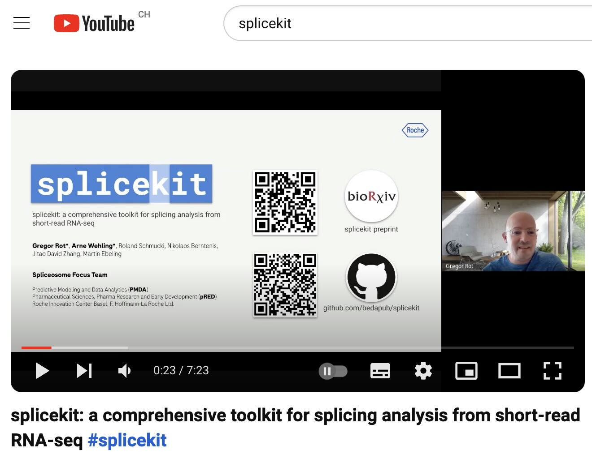

<picture></picture>

## splicekit: an integrative toolkit for splicing analysis from short-read RNA-seq

**splicekit** is a modular platform for splicing analysis from short-read RNA-seq datasets. It integrates a JBrowse2 instance, [pybio](https://github.com/grexor/pybio) for genomic operations and [scanRBP](https://github.com/grexor/scanRBP) for RNA-protein binding studies. The whole analysis is self-contained in a single project folder, and the platform itself is written in Python, in a modular way.

Check a short video presentation about splicekit (poster) at ECCB 2023 on YouTube:

[](https://youtu.be/P1m73usZ3lc?si=HBJxWOkUajObFpu1)

## Try it online: expressRNA

No installation needed: splicekit is integrated into [expressRNA.org](https://www.expressrna.org) and runs automatically as part of every **Differential Gene Expression** analysis on bulk RNA-seq data. Once a DGE analysis finishes, expressRNA triggers splicekit in the background and adds an **Alternative Splicing** panel with browsable, searchable junction/exon/gene-level results (FDR < 0.05), downloadable `splicekit.config`/`samples.tab`, and a linked JBrowse2 view — all in the browser, no local setup required.

## Quick start

Since version 0.7, splicekit is a **Snakemake** pipeline, with a Conda/micromamba environment file.

```bash
git clone git@github.com:bedapub/splicekit.git    # clone repo
cd splicekit                                      # change working directory

micromamba create -y -f splicekit.yaml            # create conda env
micromamba activate splicekit                     # activate env
./install.sh                                      # install dependencies
pip install .                                     # install splicekit

cd datasets/GSE126543                             # move to sample folder
./1_download.sh                                   # download sample FASTQs
pybio homo_sapiens                                # human genome

./run_snakemake_local.sh --configfile config.yaml # run snakemake (local)
./run_snakemake_slurm.sh --configfile config.yaml # OR run snakemake SLURM
```

After Snakemake finishes, explore the results interactively by running `splicekit web` and following the printed instructions to open the HTML report in your browser.

<details>
<summary>Installing splicekit directly from the GitHub repository</summary>

```
pip install git+https://github.com/bedapub/splicekit.git@main
```
</details>

<details>
<summary>If you already have aligned reads in BAM files</summary>

All you need is `samples.tab` (note that this is a **TAB delimited** file) and `splicekit.config` in one folder (check [datasets](datasets) for examples).

You can easily download and prepare the reference genome (e.g. `pybio genome homo_sapiens`).

Finally, run `./run_snakemake_[local/slurm].sh --configfile config.yaml` inside the folder with `samples.tab` and `splicekit.config`.

The easiest way to see what these files should look like is to check the [datasets](datasets) examples — they also include scripts for mapping FASTQ files to BAM with `pybio` if you need that step too.
</details>

## Documentation

Full documentation, including installation, a quick start guide, and reference pages for configuration, sample annotation, features, edgeR, motif/scanRBP analysis, juDGE plots, additional analyses, JBrowse2 and the command line, is available at:

* [bedapub.github.io/splicekit](https://bedapub.github.io/splicekit/)

## Changelog<a name="changelog"></a>

**Docs**: released in September 2026

* migrated documentation to a mkdocs-material site ([bedapub.github.io/splicekit](https://bedapub.github.io/splicekit/)), retiring the PDF/Google Docs manual

**v0.8.1**: released in July 2026

* added `bam_file` column support in `samples.tab` for per-sample BAM paths (subfolder layouts)
* new `get_bam_path(sample_id)` helper in `splicekit/core/annotation.py` — falls back to `{bam_path}/{sample_id}.bam` when no per-sample path is given
* `exons.py`, `genes.py`, `anchors.py`: replaced `os.listdir()` BAM discovery with `annotation.samples` list + `get_bam_path()` (enables subfolder BAMs, no dir scan needed)
* `junctions.py`, `jbrowse2.py`: same `get_bam_path()` adoption
* default `bam_column = "bam_file"` added to config

**v0.8**: released in October 2025

* removed platform config option (now snakemake submits jobs to the cluster)
* pandas and other minor improvements

**v0.7**: released in February 2025

* [Snakemake](Snakefile) version
* Conda [splicekit.yaml](splicekit.yaml) for environment setup

<details>
<summary>Past change notes (click to view)</summary>
<br>
<b>v0.6</b>: released in April 2024

* updated reports
* JUNE analysis (junction-events to classify skipped and mutually exclusive exons)

<b>v0.4.9</b>: released in November 2023

* added rMATS analysis for splicing events
* added Docker container that can be directly imported to singularity via ghcr.io
* fixed dependencies
* other small fixes

<b>v0.4</b>: released in May 2023

* added singularity container with all dependencies
* added local integrated JBrowse2
* cluster or desktop runs
* scanRBP and bootstrap analysis of RNA-protein binding
* further development and integration with pybio
* extended documentation of concepts, analysis and results

<b>v0.3</b>: released in January 2023 (click to show details)

* re-coded junction analysis
  * independent junctions parsing from provided bam files
  * master table of all junctions in the samples of the analyzed project, including novel junctions (refseq/ensembl non-annotated)
* clustering by logFC of pairwise-comparisons with dendrogram: junction, exon and gene levels (clusterlogfc module)
* added *first_exon* annotation for junctions touching annotated first exons of transcripts
* extended documentation of concepts, analysis and results

<b>v0.2</b>: released in October 2022

* software architecture restructure with python modules
* filtering of lowly expressed features by edgeR
* DonJuan analysis (junction-anchor analysis)
* more advanced motif analysis with DREME
* filtering regulated junctions with regulated donors

<b>v0.1</b>: released in July 2022

* initial version of splicekit
* parsing of junction and exon counts
* computing edgeR analysis from count tables and producing a results file with direct links to JBrowse2
* basic motif analysis

</details>

## Citing and Contact<a name="citation"></a>

If you find **splicekit** useful in your work and research, please cite:

Rot, G., Wehling, A., Schmucki, R., Berntenis, N., Zhang, J. D., & Ebeling, M. (2024)<br>
[splicekit : an integrative toolkit for splicing analysis from short-read RNA-seq](https://academic.oup.com/bioinformaticsadvances/article/4/1/vbae121/7735317)<br>
Bioinformatics Advances, 4(1). https://doi.org/10.1093/bioadv/vbae121

In case of questions, issues and other ideas, please use the <a href='https://github.com/bedapub/splicekit/issues'>GitHub Issues</a> or write directly to <a href='mailto:gregor.rot@gmail.com'>Gregor Rot</a>.
