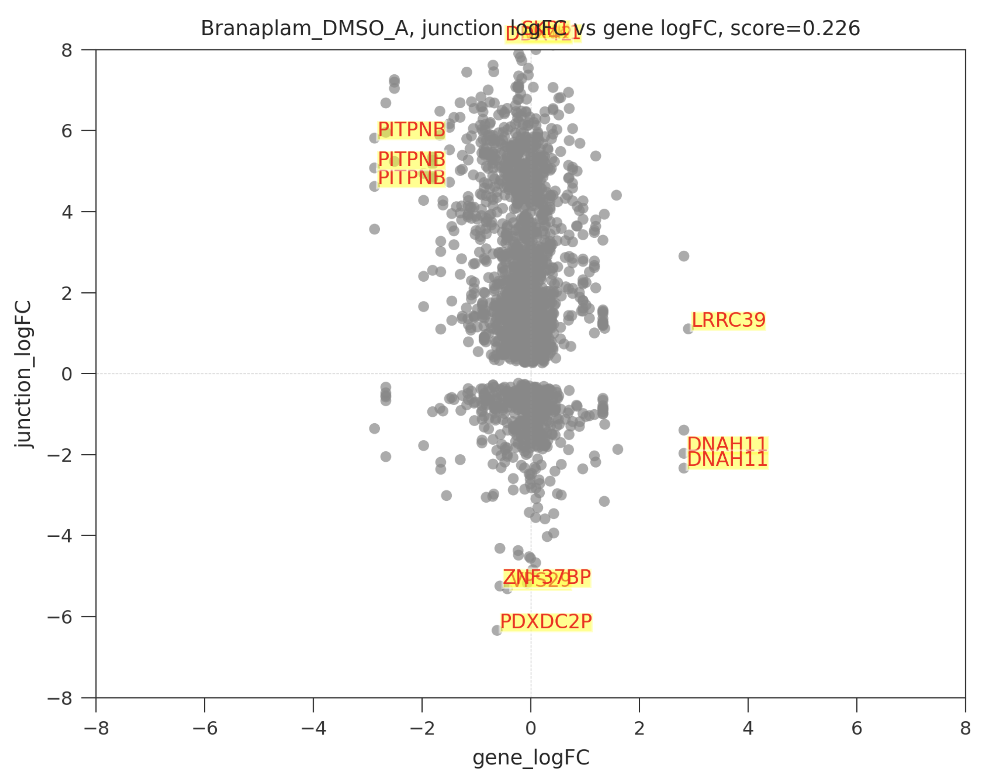

# juDGE plots

To characterize the effect of a treatment — is it mostly driving splicing changes, or general gene expression changes? — splicekit generates **juDGE plots**: junction logFC vs. gene logFC, one point per gene.

```bash
splicekit judge
```

Plots are written to `results/judge/*` as PNG images, plus interactive Plotly HTML reports (hover to see the data point and gene name).



In a plot like the one above, a comparison where junctions (y axis) are perturbed much more than gene expression in general (x axis) is characterized as a **"splicing modifier"**. A comparison with more activity on the x axis — general gene expression — is labeled an **"expression modifier"**.
